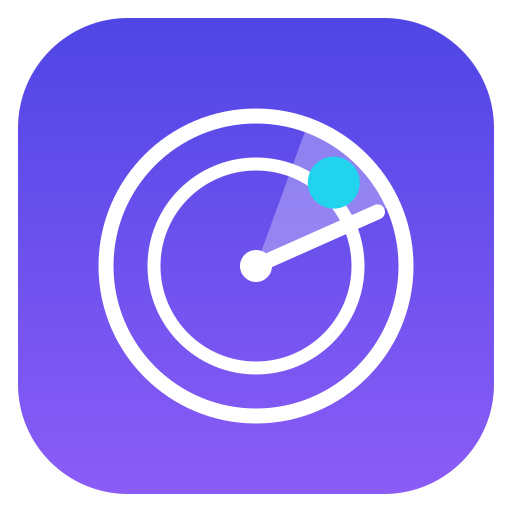
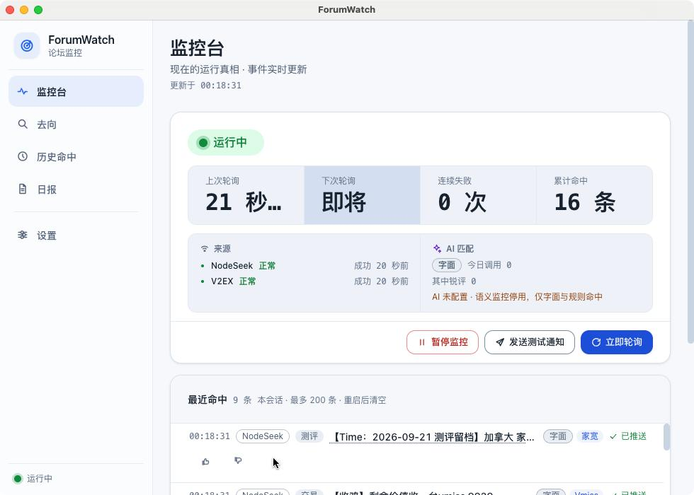
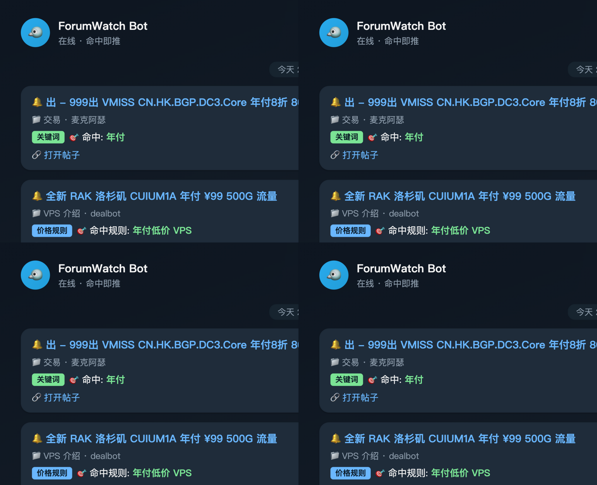
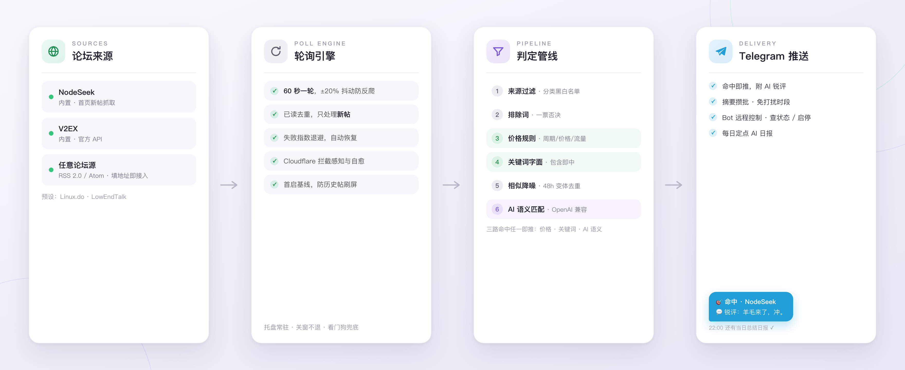
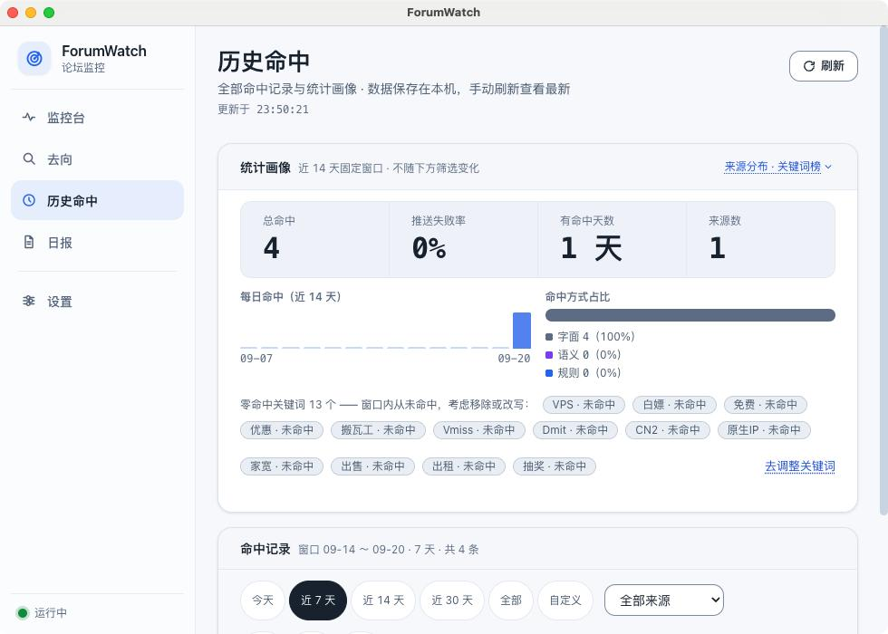
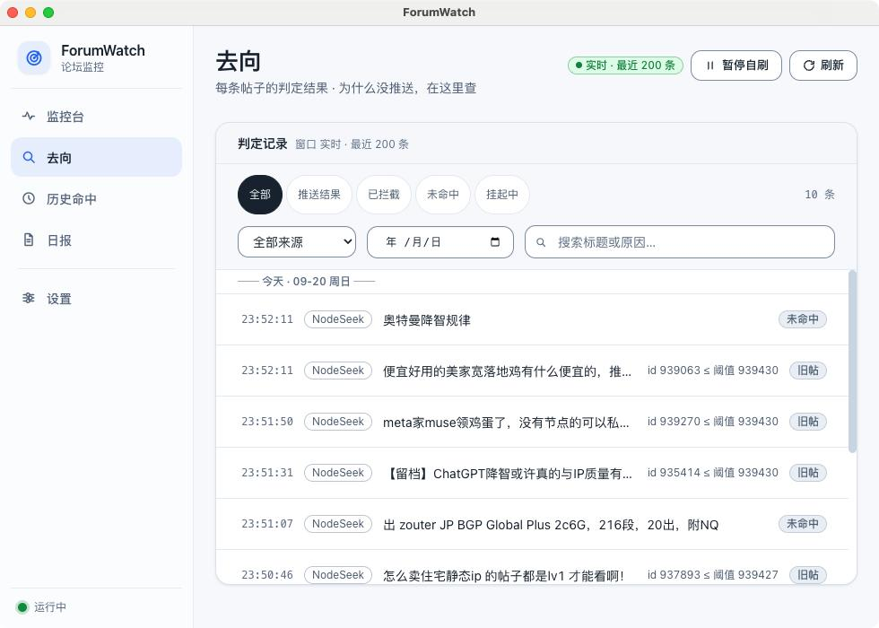

<div align="center">



# ForumWatch

**常驻系统托盘的论坛监控工具。**

你关注的论坛（NodeSeek、V2EX、或任意 RSS 论坛）一出新帖，只要命中你设的关键词、价格条件，或被 AI 判定与你有关，就会立刻推送到你的 Telegram。全程本机运行，关窗不退。

[macOS / Windows](#-安装) · [5 分钟上手](#-上手) · [深度文档](docs/usage.md) · [MIT](LICENSE)

</div>

<br />

<table>
<tr>
<td align="center"><br/><sub>监控台：运行状态、每个来源的健康度、最近命中与处置去向</sub></td>
<td align="center"><br/><sub>命中时的推送长这样（Telegram 通道示意）</sub></td>
</tr>
</table>

## ✨ 它做什么

- **盯住任何论坛**：内置 NodeSeek 与 V2EX；任意提供 RSS 2.0 / Atom 的论坛填地址即可接入，设置页有 Linux.do、LowEndTalk（全站）、LowEndTalk Offers（只推优惠帖，feed 相同 + 分类白名单过滤）一键预设。每个来源还能单独覆盖关键词 / 匹配模式 / AI 兴趣（该行「匹配」面板，留空跟全局）。每个来源独立健康状态，一个被拦不拖累其他。
- **三种方式决定"什么算值得推送"**，可叠加：
  - **关键词**：包含词任一命中即推，排除词一票否决，大小写不敏感。
  - **价格规则**：从标题提取「周期 / 价格 / 流量」（如"年付 ¥99、500G 流量"），按你的条件（如"年付 + ≤¥100 + ≥500G"）精确比对——找 VPS 羊毛的利器，确定性命中、零成本。
  - **AI 语义匹配**（可选）：配置任意 OpenAI 兼容模型（内置 DeepSeek / Kimi / GLM 预设），用自然语言写兴趣（"Oracle 免费 ARM 的羊毛""年付 100 元以内的低价小鸡"），AI 逐帖判断。还能在命中行点 👍/👎 反馈，越用越合口味；没配 AI 自动按关键词监控，不中断。
- **推送到你的 Telegram**：命中即推，可附一句 AI 锐评；支持摘要攒批与免打扰时段，还能用 Bot 远程控制（查状态 / 启停 / 改配置）。
- **不只是一条通知**：AI 可给每条命中附一句锐评；每天定点把当天命中总结成日报推给你。
- **"为什么没推送"永远有答案**：每条帖子每一轮的去向（未命中 / 被排除 / 已推送 / 推送失败……14 类出口）全量记入「流水」页；「历史命中」支持日期 / 来源 / 命中方式检索，顶部统计面板告诉你哪些关键词从未命中、该删了。
- **细节上为长期常驻做了功课**：随机抖动与指数退避防反爬、Cloudflare 拦截感知与自动恢复、首启基线防刷屏、相似转发变体降噪、凭据经系统钥匙串加密落盘、窗口关闭即最小化到托盘继续监控、引擎看门狗兜底。

## 🗺 工作原理



## 📦 安装

到 [Releases](https://github.com/learningdog1/ForumWatch/releases) 下载对应平台的安装包：

| 平台 | 文件 | 注意 |
| --- | --- | --- |
| macOS (Apple Silicon / Intel) | `.dmg` | 未签名：首次打开请**右键 → 打开**（只做一次）。仍提示"已损坏"时执行 `xattr -cr /Applications/ForumWatch.app` |
| Windows | `.exe` (NSIS) | 未签名：SmartScreen 提示时点"更多信息 → 仍要运行" |

## 🚀 上手

1. **装好启动**。首次启动只把首页现有帖子记为已读、不推送，不会被历史帖刷屏。
2. **给关键词**：设置 → 关键词，加入你关心的词（如 `VPS`、`白嫖`），保存。⚠️ 包含关键词为空 = 不推送任何帖子，这是防误设计。
3. **接来源**（可选）：设置 → 来源，一键添加 V2EX / Linux.do / LowEndTalk / LowEndTalk Offers 预设，或填任意论坛的 RSS / Atom 地址。
4. **接推送**：设置 → 推送通道，配 Telegram：
   - 找 [@BotFather](https://t.me/BotFather) 发 `/newbot` 拿到 **Bot Token**；
   - **给这个 bot 发一条消息**（不然它无法主动找你）；
   - Chat ID 问 [@userinfobot](https://t.me/userinfobot) 要，填入保存。
5. **点「发送测试消息」**，收到一条即成功。之后窗口可以关掉，托盘继续盯论坛。
6. **（可选）配 AI**：设置 → AI 模型选个预设（DeepSeek / Kimi / GLM）填 API Key，测试连接通过后切到语义匹配，或开启每日总结。

<table>
<tr>
<td align="center"><br/><sub>设置页：来源、关键词、通道、规则、AI 都在侧栏锚点导航里</sub></td>
<td align="center"><br/><sub>历史命中：跨日检索 + 统计画像（推送失败率、来源分布、关键词命中榜）</sub></td>
</tr>
</table>



<sub>流水页：433 条处置记录里，"大陆的 VPS 有无推荐？"命中了 `VPS` 并已推送；其余被"未命中 / 旧帖 / 排除词"等去向逐条解释。</sub>

## ❓ 常见问题

**收不到推送？** 点设置页的「发送测试消息」：收不到 → 检查关键词是否命中过标题、bot 是否被你先发过消息、代理配置（大陆网络见下一条）；「历史命中」里每条记录都带送达明细。更细的排查矩阵见 [深度文档](docs/usage.md#故障排查矩阵)。

**状态显示"Cloudflare 拦截"？** 部分站点（NodeSeek 偶发，Linux.do / LowEndTalk 常见）会发起人机验证。通常什么都不用做——应用会自动退避重试并自愈；频繁出现多半是轮询太快，调大间隔即可，也可在「设置 → 网络」开代理换出口。

**关掉窗口还在监控吗？** 在。关窗即最小化到托盘；macOS 上不出现在程序坞与 Cmd+Tab 里，退出走托盘菜单的「退出」。

**Telegram 收不到，我在大陆？** api.telegram.org 通常需要代理：「设置 → 网络」填入 `http://127.0.0.1:7890` 或 `socks5://127.0.0.1:1080` 这类地址即可（默认只让 Telegram 走代理，其余直连）。

## 📖 想了解每一项的具体语义

README 只负责让你决定要不要用。每一项行为的准确语义——关键词与价格规则的提取口径、AI 配置与限额、推送路由与重试、处置流水的 14 类出口、headless 直跑模式、已知限制清单——全部在 **[深度文档 docs/usage.md](docs/usage.md)**，与代码实现一一对应。

## 🛠 开发

```bash
npm install        # 无原生模块，不需要编译工具链
npm run dev        # 开发模式（electron-vite）
npm test           # 单元测试（vitest，内核全部为不依赖 Electron 的纯模块）
npm run typecheck  # 类型检查（node + web 两套 tsconfig）
npm run dist:mac   # 打 mac 安装包；dist:win 在 mac 上交叉打 NSIS 包
```

结构速览：`src/main` 的监控内核（`monitor/ ai/ notify/ net/ config/`）零 Electron 依赖，可 `npm run engine:headless` 在 node 下直跑；`src/renderer` 为 React UI。CI（typecheck + 测试 + 构建）与双平台 Release 发布已配好，细节见 [深度文档](docs/usage.md#headless-模式) 与 `.github/workflows/`。

## License

[MIT](LICENSE) © colmidad
